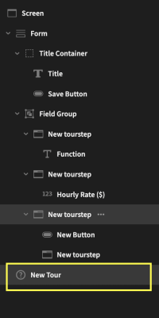
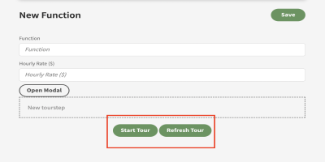
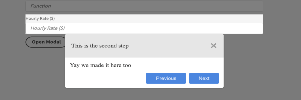
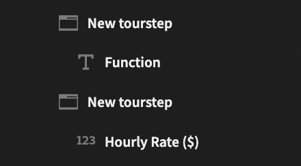
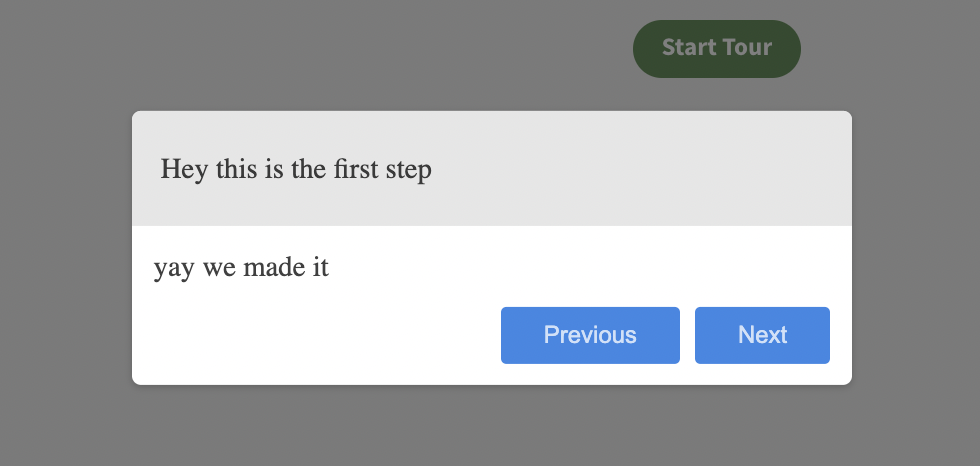
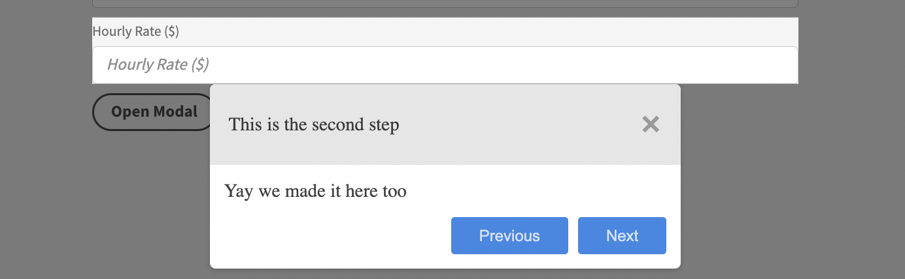
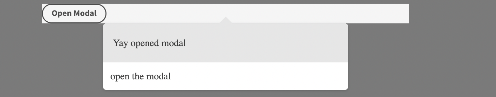
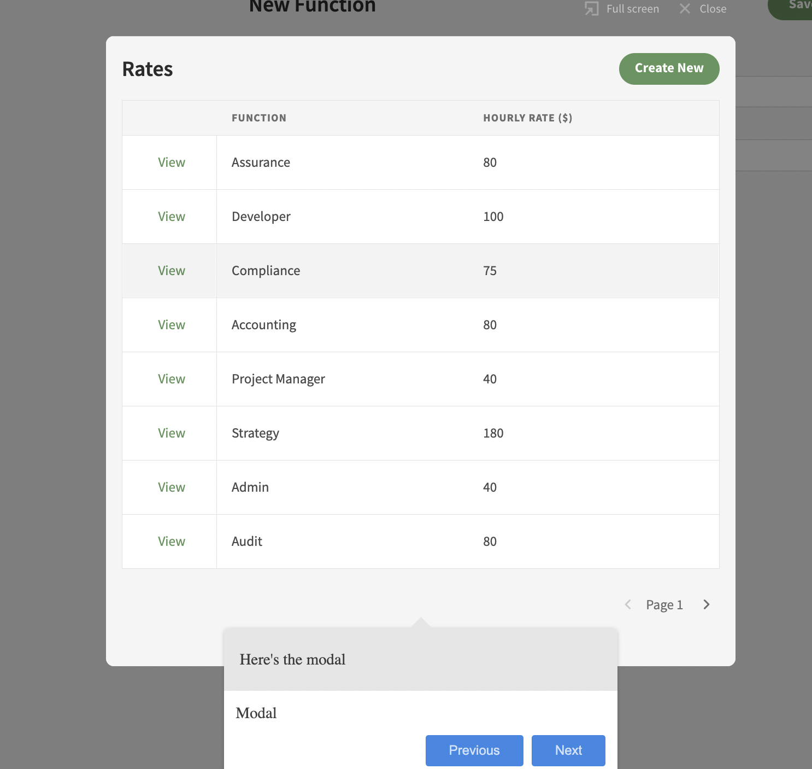

A component that allows you to create dynamic walkthroughs based off of [Shepherd by Ship Shape] (https://github.com/shipshapecode/shepherd). This plugin is part of a ste, meaning you must install the companion plugin [Tour Step](https://github.com/JayP718/tour_step_bb_plugin) here (as every shepherd needs it's sheep :) )).

Find out more about [Budibase here](https://github.com/Budibase/budibase).

## Instructions

1) Make sure you have both this plugin (Tour-Shepherd) and the companion plugin [Tour Step] (https://github.com/JayP718/tour_step_bb_plugin) installed.

Follow instructions [here](https://docs.budibase.com/docs/custom-plugin#:~:text=Importing%20plugins,pressing%20the%20Add%20plugin%20button.) to install both plugins

2) Add the "Tour" plugin to your screen. This means that you have now added one tour to your screen. You can have multiple just make sure they have different names.

  

3) Set the settings for the tour. See list below.

|Settings | Description |
|------------- | ------------- |
|Shepherd Tour Name|Must be unique for every tour.  |
|Tour Steps|Autogenerated field by pressing the refresh tour button within the builder. |
|Modal Overlay|Shows a modal overlay when showing the steps to direct the user's focus. |
|Auto Start OnLoad|Automatic loads the tour|
|Auto Start Field|Bindable field which must return a true or false value.(To only show tour once...etc)|
|Confirm Cancel Dialog|Show an alert before allowing user to cancel|
|Confirm Cancel Message |Customize cancel message|
|Exit on Escape|Allow user to end tour by pressing escape.|
|Keyboard Navigation|Allow user to use forward/back arrow keys to navigate tour|
|On Completion|Actions to take place on completion|
|On Cancel|Actions to take place on cancel|

4) Add [tour steps](https://github.com/JayP718/tour_step_bb_plugin) to your app by adding and encapsulating other elements within the tour step. The tour step will show around the elements within the tour step.

  

5) Edit each tour step to personalize it however you would like. See settings below

|Settings | Description |
|------------- | ------------- |
|Tour Name|This must match the tour in which you want the tour step to appear for. |
|Title|This is the title of the tour step which appears at the top of the step.|
|Text|This is the text of the tour step which appears within the step. (Accepts HTML Markup) |
|Ranking|IMPORTANT must be unique for that tour. Must also be greater than 0|
|Pop-Up Position|Where the pop up will appear.|
|Advance On|True/False value which states whether the tour should continue when an action is taken on an element|
|CSS Selector|The selector for element which should should advance to next step.|
|Show Previous Button|Shows previous button.|
|Show Next Button|Shows next button.|
|Shows Complete Button|Shows complete button and closes tour|
|Show Cancel Icon|Shows Cancel Icon|
|Target Clickable|Allows elements within target to be clicked.|
|Shows Arrow|Shows arrow|
|Modal Step|If step leads to modal to be opened this should be true. This allows the user to continue to tour upon closing the modal and allows modals to have their own tours.|

6) Click refresh tour within the builder to update your steps. This automatically edits the tour step settings.

7) Test and enjoy your tour!

# HELP NEEDED

Steps which lead to modals to be opened is still a little janky. If anyone has any hints to identify and fire an event if modal is closed please reach out!